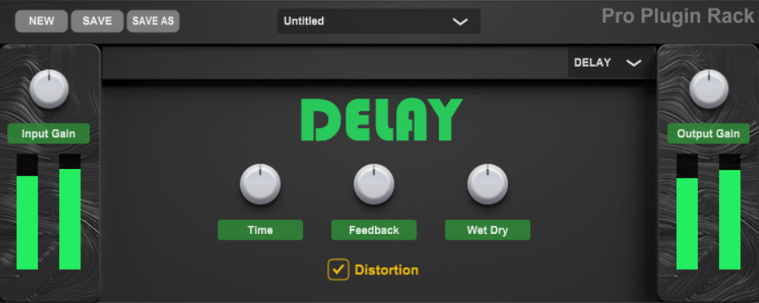
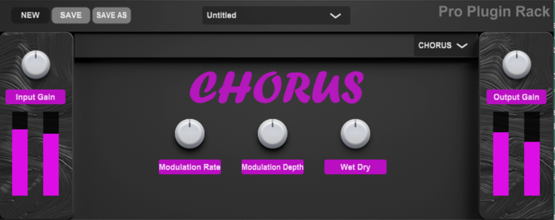

# Pro-Delay-Chorus
### NOTE: This plugin is under construction and does not reflect a finalized product.

## Description
Building on the ideas and algorithms used in previous Delay and Chorus/Flanger projects, this new plugin features advanced design techniques which focus on modularity, object-oriented programming principles, the D.R.Y principle, readability, reusability, and efficiency.

This plugin features a Delay module with distortion capability in the feedback loop, a preset management system for saving and loading different parameter settings, VU meters for visual display of signal level at input and output ports, and a modern UI.

The Pro Delay/Chorus project cleanly organizes the plug-in architecture by packaging all DSP code into individual modules to support easy signal-chain reconfiguration and by formatting the UI in a manner that allows adjustments to be made simply without having to change multiple lines throughout the project. These considerations also provide a great aid to the debugging process.

## GUI

(**NOTE**: 
*This plugin was built as a part of the Kadenze course offered by Output, Inc. titled "Advanced Audio Plugin Development". All graphical assets were provided by Output, Inc.*)
